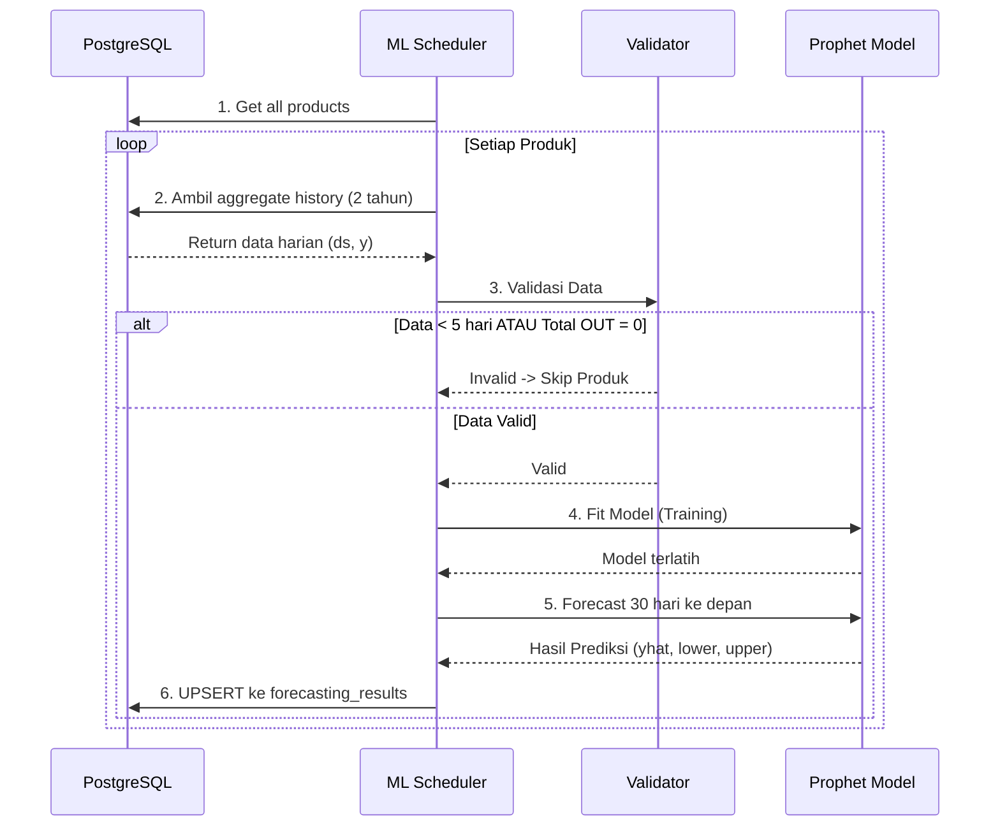

# 🧠 Dokumentasi Machine Learning Service (Prophet)

Dokumen ini menjelaskan arsitektur, alur kerja, dan algoritma dari layanan Machine Learning (ML Service) yang bertugas melakukan *forecasting* (prediksi) konsumsi stok barang menggunakan algoritma **Prophet** dari Meta.

---

## 1. Arsitektur Sistem

ML Service dirancang sebagai **Microservice Mandiri (Decoupled)** berbasis Python. Service ini berjalan di *background* secara terus-menerus menggunakan *scheduler* dan terpisah sepenuhnya dari Ktor Backend API.

**Kelebihan arsitektur ini:**
- **Performa:** Proses *fitting* model ML sangat berat. Dengan memisahkannya, performa Ktor API untuk melayani user (HTTP requests) tidak akan terganggu.
- **Skalabilitas:** ML Service bisa di-deploy di server atau *container* terpisah dengan spesifikasi yang disesuaikan untuk komputasi berat.
- **Modularitas:** Jika suatu saat algoritma ML diganti (misal ke LSTM atau XGBoost), Ktor Backend tidak perlu diubah sama sekali.

---

## 2. Alur Kerja (End-to-End Pipeline)

ML Service menggunakan arsitektur *Polling* dengan interval setiap 5 menit. Berikut adalah alur kerjanya:



### Penjelasan Langkah:
1. **Fetch Products:** Mengambil semua daftar produk yang ada di database.
2. **Fetch Aggregate Data:** Mengambil data histori konsumsi harian dari tabel `daily_aggregates` maksimal **730 hari (2 tahun)** ke belakang.
3. **Validasi:** Memastikan data cukup untuk dipelajari (minimal 5 hari). Jika data kurang atau tidak ada histori konsumsi (semua OUT = 0), produk dilewati (*skip*).
4. **Data Preparation:** Data mentah diubah ke dalam *DataFrame* berformat standar Prophet: `ds` (tanggal) dan `y` (jumlah total_out). Tanggal yang kosong (*missing dates*) otomatis diisi dengan nilai `0`.
5. **Model Fitting & Prediction:** Model Prophet "belajar" dari histori data tersebut, kemudian memprediksi konsumsi untuk **30 hari** ke depan.
6. **Persistensi:** Hasil prediksi (Confidence Interval 95%) disimpan ke tabel `forecasting_results` menggunakan metode UPSERT agar tidak ada data duplikat jika diprediksi ulang di hari yang sama.

---

## 3. Algoritma ML: Meta Prophet

Sistem telah bermigrasi dari Regresi Linear ke **Prophet**, sebuah pustaka *time-series forecasting* *open-source* yang dikembangkan oleh tim Core Data Science di Meta.

### Mengapa Prophet? (Sesuai Arahan Dosen)
Pendekatan ML konvensional yang memakan "data mentah" rentan terhadap *noise*. Praktik terbaik dalam *time-series* adalah melakukan agregasi harian terlebih dahulu. Prophet sangat unggul karena:
- **Menangkap Seasonality:** Mampu mendeteksi pola mingguan (misal: weekend sepi, weekday ramai) dan pola tahunan (misal: lonjakan konsumsi saat Natal/Lebaran).
- **Robustness:** Sangat tangguh menghadapi *outliers* (pencilan data) dan *missing data* (data kosong).
- **Trend Detection:** Mampu mendeteksi pergeseran tren jangka panjang (bisnis yang sedang bertumbuh atau menurun).

### Output Forecasting (Confidence Interval 95%)
Untuk setiap prediksi harian, Prophet menghasilkan 3 parameter yang akan digunakan oleh frontend untuk memberikan visualisasi prediktif:
1. **`predicted_value` (yhat):** Prediksi utama / rata-rata estimasi stok yang akan keluar.
2. **`lower_bound` (yhat_lower):** Batas bawah (Skenario Paling Sepi). Mengindikasikan batas konsumsi terendah.
3. **`upper_bound` (yhat_upper):** Batas atas (Skenario Paling Ramai). Mengindikasikan estimasi maksimal barang yang bisa keluar, berguna untuk peringatan *restock* dini.

---

## 4. Struktur Database Pendukung

ML Service membaca dari tabel aggregate dan menulis ke tabel forecasting.

### 📥 Input: `daily_aggregates`
*(Dibuat oleh Ktor Backend via cron-job jam 23:59)*
- `date`: Tanggal rekapitulasi.
- `total_out`: Total barang yang keluar (di-scan RFID) pada hari itu. **(Ini adalah variabel target `y` untuk Prophet)**.
- `total_in`: Total barang yang diregistrasi / di-restock.
- `net_flow`: `total_in` - `total_out`.

### 📤 Output: `forecasting_results`
*(Dihasilkan oleh ML Service)*
- `target_date`: Tanggal prediksi di masa depan (H+1 sampai H+30).
- `predicted_value`: Hasil prediksi angka pasti.
- `lower_bound`: Batas bawah keyakinan 95%.
- `upper_bound`: Batas atas keyakinan 95%.

---

## 5. Konfigurasi (`.env` dan `config.py`)

Service dikonfigurasi melalui *environment variables*:

| Variabel | Default | Deskripsi |
|---|---|---|
| `DATABASE_URL` | *(wajib)* | Connection string ke PostgreSQL Neon. |
| `MIN_DATA_POINTS` | `5` | Jumlah hari minimal histori agregat yang dibutuhkan agar Prophet mau melakukan fitting. |
| `HISTORY_DAYS` | `730` | Membaca riwayat data maksimal 2 tahun ke belakang (untuk menangkap pola tahunan/musiman). |
| `FORECAST_HORIZON_DAYS` | `30` | Jumlah hari ke depan yang akan diprediksi oleh sistem. |
| `SCHEDULE_INTERVAL_MINUTES` | `5` | Jeda waktu scheduler berjalan berulang (dalam menit). |

---

## 6. Operasional Service

### Cara Instalasi Dependencies
Sistem menggunakan Python 3.10+. Kebutuhan pustaka terdapat di `requirements.txt`. Pastikan C++ Build Tools tersedia di OS (khususnya Windows) karena Prophet bergantung pada `pystan`/`cmdstanpy`.
```bash
pip install -r requirements.txt
```

### Cara Menjalankan Service
```bash
python main.py
```
Service akan mulai mengeksekusi iterasi pertamanya seketika, dan selanjutnya akan menjadwalkan dirinya sendiri setiap 5 menit di latar belakang. Service tidak akan berhenti sebelum diinterupsi oleh sistem (`Ctrl+C` atau proses *kill*).

### Penyimpanan Model Lokal
Setiap kali ML Service berhasil melakukan iterasi *fitting* untuk suatu produk, service juga akan menyimpan bobot (weights) model dan metadatanya secara lokal di direktori `models/`:
- `namaproduk_prophet_model.json`: Serialize dari model state Prophet.
- `namaproduk_metadata.json`: Detail jumlah data point yang dipakai dan konfigurasi *horizon*. 
*(Berguna untuk proses audit model atau debugging lokal).*
